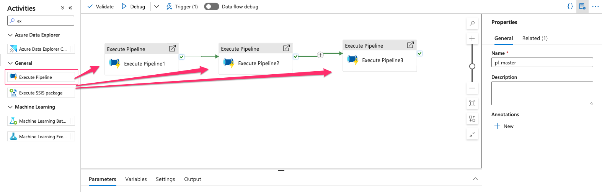
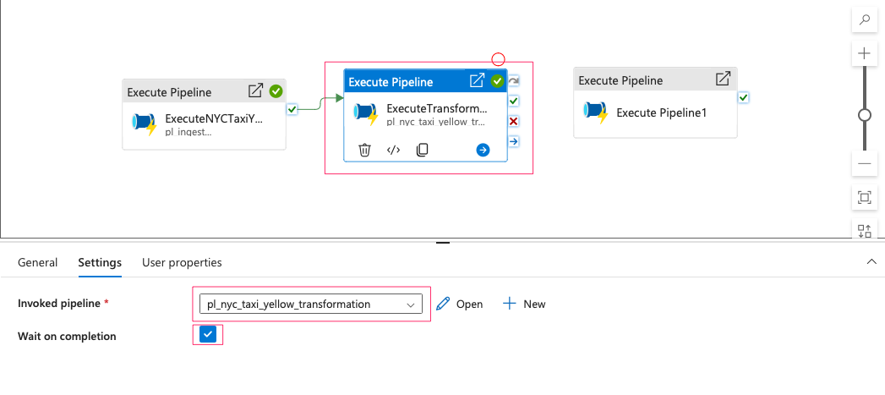
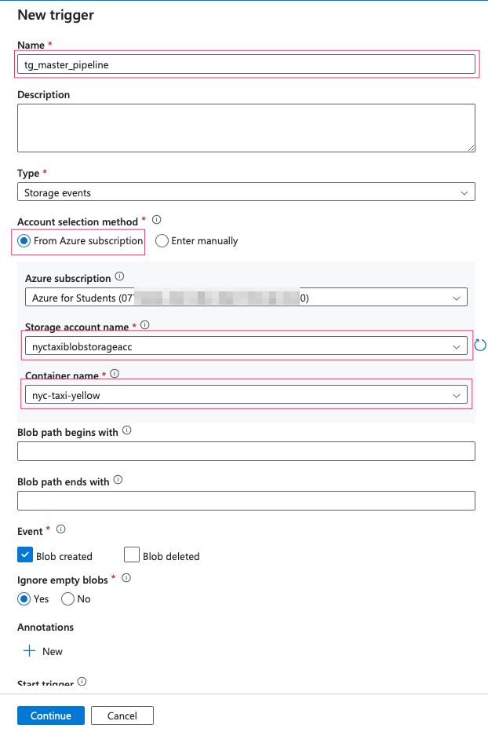

#  Overview

In this project, I will implement a complete end-to-end data flow, covering all stages from data ingestion to final visualization. The primary objective is to create a seamless data pipeline using **Azure Data Factory (ADF)**, which will automate data movement, transformation, and loading processes. The dataset I will use is the **NYC Taxi dataset**, which contains detailed trip data, including pick-up and drop-off locations, passenger counts, fares, and other relevant metrics. 

The workflow will begin with the **ingestion** of raw data from a blob storage container, followed by **transformation steps** such as cleaning, aggregation, and enrichment of the data (e.g., adding taxi zone information). I will implement these transformations using ADF’s **data flow transformations** and **pipeline orchestration** features to ensure efficient processing.

The transformed data will then be stored in a suitable target for **visualization**, such as a data warehouse or storage account, where I can connect to visualization tools like **Power BI** or **Tableau**. This visualization will provide key insights into taxi trends, including trip frequency, passenger behavior, and fare distribution across different regions and times.

This project will demonstrate my ability to build a scalable, automated data pipeline using **ADF’s scheduling and orchestration capabilities**, efficiently handling data transformations and integrating with visualization tools to derive actionable insights from the NYC Taxi dataset.

#  Table of contents:
 1. Overview
 2. Table of contents
 3. Implementation

#  Implementation
##  Set up Resources:

In this section, we are going to generated some resources such as resource group, storage accounts, containers, SQL database, Databricks and connect them all to Azure Data Factory via linked services.

For detailed instruction, please refer: [Create_Resources](readme/create_resources.md)

## Data Ingestion:
### 1. Data Ingestion from Azure Blob Storage

The first method I’m using for data ingestion involves creating an ingestion pipeline. When a data file is uploaded to the blob container, it triggers a series of pipeline activities. These activities include checking if the file exists and validating whether the data contains exactly 19 columns. If the validation passes, the file is copied to ADLS2. If not, a failure notification is sent to Discord.

For detailed instruction, please refer: [Data Ingestion from Blob Container](readme/data_ingestion_from_blob_storage.md)

### 2. Data Ingestion from HTTP

The second ingestion method is using http connection. Imagine that you can schedule a monthly data scraping job to get the download link from the source website, then the pipeline can directly extract the parquet file from the website and copy it into ADLS2.

For detailed instruction, please refer: [Data Ingestion from HTTP](readme/data_ingestion_from_http.md)

### 3. Data Transformation using Dataflow:

In this dataflow, we will enhance the NYC taxi yellow trip data by performing a taxi zone lookup from a reference file to enrich the dataset. Additional transformations include dropping unnecessary columns, filling missing values, correcting data types, filtering invalid records, and renaming columns for better readability. These steps ensure the data is clean, consistent, and ready for analysis.

For detailed instruction, please refer: [Data Ingestion from HTTP](readme/data_transformation.md)

### 4. Ingest processed data into SQL Database

#### 4.1 Create NYC Taxi Yellow SQL Table

- Access to your SQL database you have created before. Open Query Editor (you also can use Azure Data Studio to create tables):

- Upload SQL file into the query editor or you can write your own:

- Run the Query to generate table:

#### 4.2 Create A Pipeline to copy data to SQL database:

- Create a new pipeline and drag Copy data into the pipeline

- Source is the processed dataset:

- We need to create a new dataset for sink:

- Dataset type is SQL:

- We also need to create a new linked service:

- You can run a simple query to test your table:

##### Create A Pipeline for Transformation Data Flow:

- Create a new pipeline then drag Data Flow into the pipeline:

- In the Settings tab, select data flow and compute size:

##### Create A Master Pipeline:

- So we already 1 pipelines for data ingestion, 1 pipeline for transformation and the other one to copy into SQL database, we need to connect them altogether. The idea is that whenever the parquet file is uploaded into blob container, it will automatically trigger the data ingestion pipeline. When it finished, it will then start transformation process, and finally copy the processed data into SQL database.

- Create a new pipeline and drag 3 Execute pipelines into the board:

- First is to excute NYC Taxi Yellow Ingestion Data:

- Since this is the first pipeline, we don't need it to be waited on completion of the previous pipeline:

- Second execution is transformation and it needs to wait until the ingestion pipeline to be finished.

- Third execution is copy processed data into SQL database:

##### Create A Trigger for Master Pipeline:

- The will start when we upload the parquet file into blob container. So firstly, we need to removed all the triggers we created before, then create a new one.

