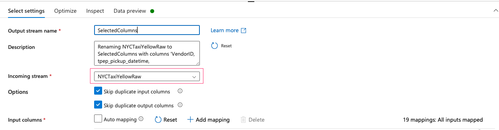
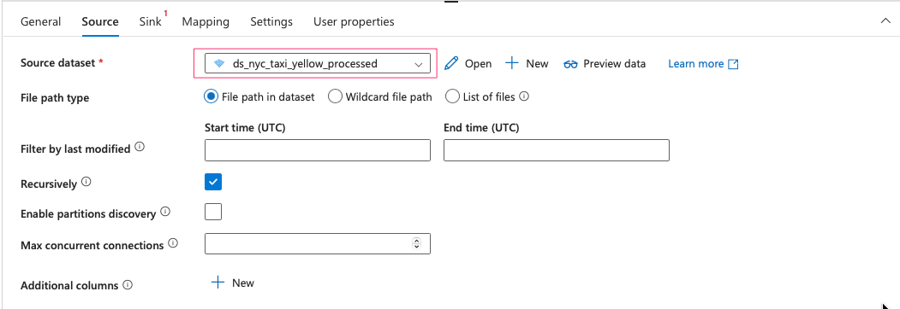
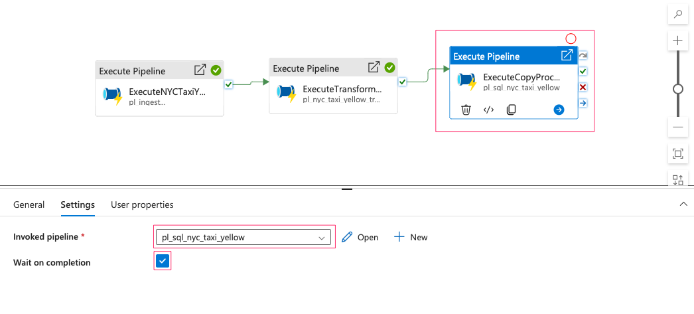
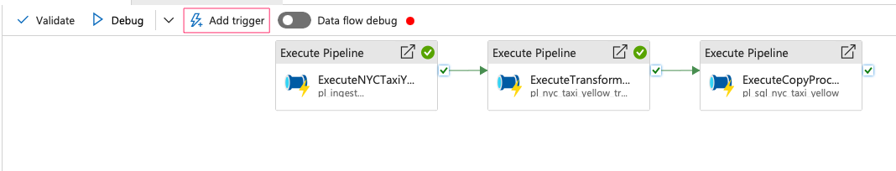

#  Overview

In this project, I will implement a complete end-to-end data flow, covering all stages from data ingestion to final visualization. The primary objective is to create a seamless data pipeline using **Azure Data Factory (ADF)**, which will automate data movement, transformation, and loading processes. The dataset I will use is the **NYC Taxi dataset**, which contains detailed trip data, including pick-up and drop-off locations, passenger counts, fares, and other relevant metrics. 

The workflow will begin with the **ingestion** of raw data from a blob storage container, followed by **transformation steps** such as cleaning, aggregation, and enrichment of the data (e.g., adding taxi zone information). I will implement these transformations using ADF’s **data flow transformations** and **pipeline orchestration** features to ensure efficient processing.

The transformed data will then be stored in a suitable target for **visualization**, such as a data warehouse or storage account, where I can connect to visualization tools like **Power BI** or **Tableau**. This visualization will provide key insights into taxi trends, including trip frequency, passenger behavior, and fare distribution across different regions and times.

This project will demonstrate my ability to build a scalable, automated data pipeline using **ADF’s scheduling and orchestration capabilities**, efficiently handling data transformations and integrating with visualization tools to derive actionable insights from the NYC Taxi dataset.

#  Table of contents:
 1. Overview
 2. Table of contents
 3. Implementation

#  Implementation
##  Set up Resources:

In this section, we are going to generated some resources such as resource group, storage accounts, containers, SQL database, Databricks and connect them all to Azure Data Factory via linked services.

For detailed instruction, please refer: [Create_Resources](readme/create_resources.md)

## Data Ingestion:
### 1. Data Ingestion from Azure Blob Storage

The first method I’m using for data ingestion involves creating an ingestion pipeline. When a data file is uploaded to the blob container, it triggers a series of pipeline activities. These activities include checking if the file exists and validating whether the data contains exactly 19 columns. If the validation passes, the file is copied to ADLS2. If not, a failure notification is sent to Discord.

For detailed instruction, please refer: [Data Ingestion from Blob Container](readme/data_ingestion_from_blob_storage.md)

### 2. Data Ingestion from HTTP

The second ingestion method is using http connection. Imagine that you can schedule a monthly data scraping job to get the download link from the source website, then the pipeline can directly extract the parquet file from the website and copy it into ADLS2.

For detailed instruction, please refer: [Data Ingestion from HTTP](readme/data_ingestion_from_http.md)

##### Create Transformation Dataflow: NYC Taxi Yellow

In this dataflow, we are going to look up taxi zone in the lookup file and add them to the NYC taxi yellow data. We also implement other transformation such as drop unnecessary columns, filling in missing values...

- Create new dataflow:

- Add a new source which is the NYC taxi yellow data:

- Add another source which is the lookup file:

- You may need to change the data type of LocationID as Integer:

- We need to create new columns for Pickup and Dropoff in the lookup file. Add Derived Column, then create those new columns as below:

- Select necessary columns: 

- Keep these below columns and delete the rest:

- Add Lookup in the next transformation step. PULocationID and DOLocationID in Taxi data should match with PULocationID and DOLocationID in the lookup file.

- Turn all Fare amount values into absolute values: add Derived Column into the flow:

- Filter for trip distance and fare amount to be greater than 0 only: add Filter into the flow:

- In this step we are going to calculate the average of tip amount and fill in missing values. First, add Window into the flow. Then create a new column called tip_amount_avg:

- Add Derived Column into the flow, then fill in missing values for tip_amount:

- Next step is to find the median of passenger_count to fill in missing value. Azure Data Factory does not support a median function, therefore we have to walk around a bit. First, we have to input the source again, then sort passenger_count to find the median value. After that, we will join the median with the original flow.

- Add the NYC taxi yellow source:

- Select only passenger_count column using Select:

- Sort passenger_count using Sort:

- Next we need to turn the passenger_count into a list and find the numer of rows using Aggregate:

- Now we already sorted the passenger count and had the row count. We need to find the median value using Derived Column:

- We also need to create another column called group and assign a constant value so that later we can join with the original data:

- We need to do the same for the original flow. So add a Dervied Column to the original flow, then create a column call group with constant value 1:

- Now we need to Join the 2 flows together:

- With the new median column, we can fill in missing values for passenger_count using Derived Column:

- Drop unnecessary columns using Select:

- Update RatecodeID: add Derived Column to the flow:

- Drop 'Unknow' PUBorough and DOBorough using Filter:

- Update RatecodeID 99 to null: add Derived Column to the flow

- Update RatecodeID to specific Borough and zone conditions when RatecodeID is null: add Derived Column to the flow:

- Set the rest of null RatecodeID to 1:

- Update the values of RatecodeID to make them more meaningful:

- We have reach the final step of data transformation. Add Sink into the flow:

- Create a new dataset for Sink:

##### Create NYC Taxi Yellow SQL Table

- Access to your SQL database you have created before. Open Query Editor (you also can use Azure Data Studio to create tables):

- Upload SQL file into the query editor or you can write your own:

- Run the Query to generate table:

##### Create A Pipeline to copy data to SQL database:

- Create a new pipeline and drag Copy data into the pipeline

- Source is the processed dataset:

- We need to create a new dataset for sink:

- Dataset type is SQL:

- We also need to create a new linked service:

- You can run a simple query to test your table:

##### Create A Pipeline for Transformation Data Flow:

- Create a new pipeline then drag Data Flow into the pipeline:

- In the Settings tab, select data flow and compute size:

##### Create A Master Pipeline:

- So we already 1 pipelines for data ingestion, 1 pipeline for transformation and the other one to copy into SQL database, we need to connect them altogether. The idea is that whenever the parquet file is uploaded into blob container, it will automatically trigger the data ingestion pipeline. When it finished, it will then start transformation process, and finally copy the processed data into SQL database.

- Create a new pipeline and drag 3 Execute pipelines into the board:

- First is to excute NYC Taxi Yellow Ingestion Data:

- Since this is the first pipeline, we don't need it to be waited on completion of the previous pipeline:

- Second execution is transformation and it needs to wait until the ingestion pipeline to be finished.

- Third execution is copy processed data into SQL database:

##### Create A Trigger for Master Pipeline:

- The will start when we upload the parquet file into blob container. So firstly, we need to removed all the triggers we created before, then create a new one.

