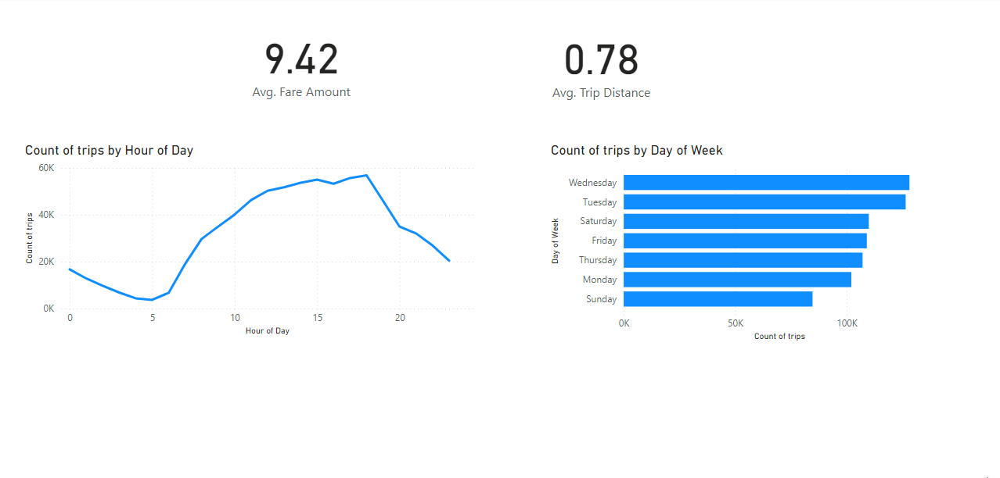

#  1. Overview

In this project, I will implement a complete end-to-end data flow, covering all stages from data ingestion to final visualization. The primary objective is to create a seamless data pipeline using **Azure Data Factory (ADF)**, which will automate data movement, transformation, and loading processes. The dataset I will use is the **NYC Taxi dataset**, which contains detailed trip data, including pick-up and drop-off locations, passenger counts, fares, and other relevant metrics. 

The workflow will begin with the scraping the downlink from a website then ingest into Azure blob storage, followed by transformation steps such as cleaning, aggregation, and enrichment of the data (e.g., adding taxi zone information). I will implement these transformations using **ADF’s data flow transformations**, **Databricks** and **pipeline orchestration** features to ensure efficient processing.

The transformed data will then be stored in a suitable target for **visualization**, such as a data warehouse or storage account, where I can connect to visualization tools like **Power BI** or **Tableau**. This visualization will provide key insights into taxi trends, including trip frequency, passenger behavior, and fare distribution across different regions and times.

This project will demonstrate my ability to build a scalable, automated data pipeline using **ADF’s scheduling and orchestration capabilities**, efficiently handling data transformations and integrating with visualization tools to derive actionable insights from the NYC Taxi dataset.

#  2. Table of contents:
 1. Overview
 2. Table of contents
 3. Implementation

    3.1 Resources setup

    3.2 Data Ingestion:

        3.2.1 Data Ingestion from Azure Blob Storage

        3.2.2 Data Ingestion from HTTP

    3.3 Data Transformation using Dataflow

    3.4 Ingest processed data into SQL Database

    3.5 Master pipeline

    3.6 Publish to Power BI

4. Monitoring

#  3. Implementation
##  3.1 Set up Resources:

In this section, we are going to generated some resources such as resource group, storage accounts, containers, SQL database, Databricks and connect them all to Azure Data Factory via linked services.

For detailed instruction, please refer: [Create_Resources](readme/create_resources.md)

## 3.2 Data Ingestion:
### 3.2.1. Data Ingestion from Azure Blob Storage

The first method I’m using for data ingestion involves creating an ingestion pipeline. When a data file is uploaded to the blob container, it triggers a series of pipeline activities. These activities include checking if the file exists and validating whether the data contains exactly 19 columns. If the validation passes, the file is copied to ADLS2. If not, a failure notification is sent to Discord.

For detailed instruction, please refer: [Data Ingestion from Blob Container](readme/data_ingestion_from_blob_storage.md)

### 3.2.2. Data Ingestion from HTTP

The second ingestion method is using http connection. Imagine that you can schedule a monthly data scraping job to get the download link from the source website, then the pipeline can directly extract the parquet file from the website and copy it into ADLS2.

For detailed instruction, please refer: [Data Ingestion from HTTP](readme/data_ingestion_from_http.md)

## 3.3 Data Transformation using Dataflow:

In this dataflow, we will enhance the NYC taxi yellow trip data by performing a taxi zone lookup from a reference file to enrich the dataset. Additional transformations include dropping unnecessary columns, filling missing values, correcting data types, filtering invalid records, and renaming columns for better readability. These steps ensure the data is clean, consistent, and ready for analysis.

For detailed instruction, please refer: [Data Transformation](readme/data_transformation.md)

## 3.4 Ingest processed data into SQL Database

The processed data stored in ADLS2 will be ingested into Azure SQL Database, making it readily available for analysis. Once in the database, the data can be queried efficiently and integrated with analytics tools like Power BI for reporting and insights.

For detailed instruction, please refer: [Ingest processed data into SQL Databse](readme/ingest_processed_data_to_SQL_database.md)

## 3.5 Master Pipeline: connecting the dots

- So we already 1 pipelines for data ingestion, 1 pipeline for transformation and the other one to copy into SQL database, we need to connect them altogether. The idea is that whenever the parquet file is uploaded into blob container, it will automatically trigger the data ingestion pipeline. When it finished, it will then start transformation process, and finally copy the processed data into SQL database.

For detailed instruction, please refer: [Ingest processed data into SQL Databse](readme/ingest_processed_data_to_SQL_database.md)

## 3.6 Publish to Power BI:

- The processed data has been ingested into the SQL database, enabling us to connect it with Power BI for analysis. By ingesting the data into SQL, we ensure it is structured and readily accessible. Now, with Power BI, we can establish a connection to the database, build visualizations, and generate insights efficiently. This integration allows us to create interactive dashboards, explore trends, and uncover actionable insights from the processed data.

- Power BI demo for NYC taxi:

For detailed instruction, please refer: [Publish to Power BI](readme/publish_powerbi.md)

# 4. Monitoring:

- The ADF monitoring system provides real-time visibility into pipelines, activities, and triggers, helping to ensure smooth data operations.

Pipelines: Track the status (success, failure, or in-progress) of end-to-end workflows.

Activities: Monitor execution details, such as duration, data volume, and errors.

Triggers: View trigger history to ensure scheduled or event-based executions occur as expected.

- Alerts and Metrics:

Set up custom alerts to notify teams via email, SMS, or Microsoft Teams for failures or delays.

Track metrics (e.g., runtime, success rates) to optimize performance and ensure timely issue resolution.

