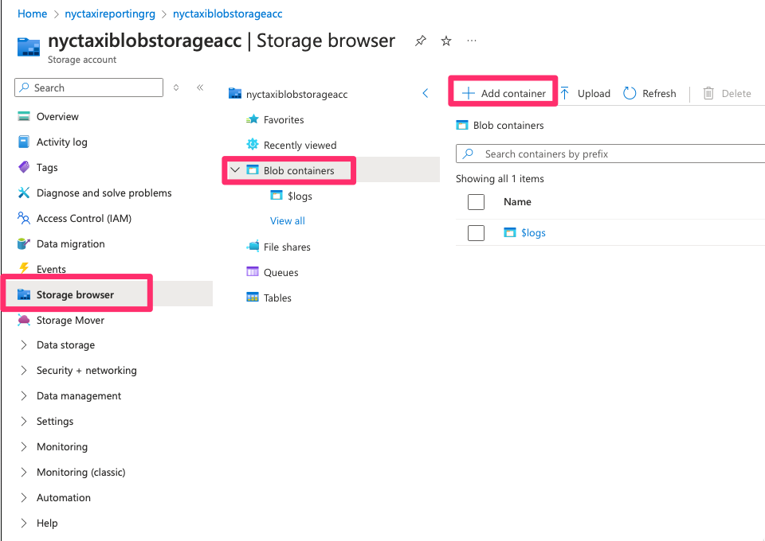
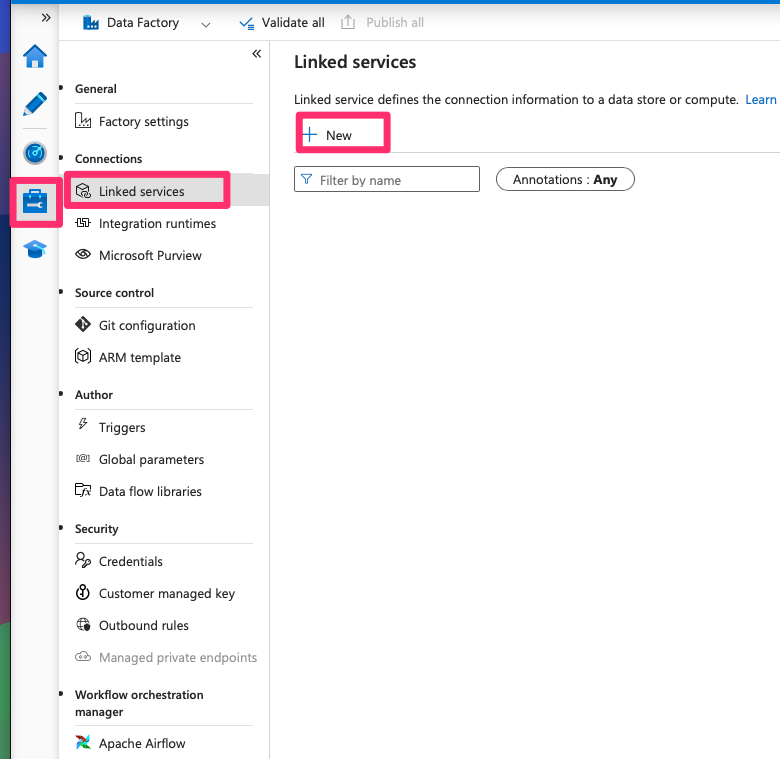

 ### Resource Group:

- Look for Resource Group in the search bar then create a new one

### Blob storage, Azure Data Lake, SQL database

- Create Blob Storage Account: Search for Storage accounts then create a new one. Make sure you select the newly generated resource group. Keep other settings as default

- Create Azure Data Lake Storage Gen 2 (ADLS gen 2): the process is the same as above. However, in the Advanced tab, enable hierarchical namespace:

- Create SQL Database: look for SQL database and create a new one.

- In the Server setup. You may need to create new server:

- Configure SQL Database setup to reduce cost:

- In the NYC resource group, you'll see 2 storage accounts, SQL server and SQL database have been generated. Next step is to create containers and database.

- Navigate to the first storage account, then Storage browser --> Blob containers --> Add container:

- Name the new container then click create:

- Repeat the 2 steps above to create a new container in the Data Lake storage account.
- [Download Azure Storage Explorer](https://azure.microsoft.com/en-us/products/storage/storage-explorer#Download-4), you can view the 2 containers under 2 storage accounts.

- You can also create new containers using Storage Explorer by right-click on Blob Containers --> Create Blob Container:

- Follow the guide above, create these below containers:

- Upload yellow taxi data and the taxi zone lookup file into containers:

- [Download Azure Data Studio](https://learn.microsoft.com/en-us/azure-data-studio/download-azure-data-studio?view=sql-server-ver16&tabs=win-install%2Cwin-user-install%2Credhat-install%2Cwindows-uninstall%2Credhat-uninstall) and connect with your database. You'll be able to see nyc-taxi-report-db in Azure Data Studio.

##### Databricks

- Look for Azure Databricks in the search bar, then create a new Databricks workspace

- Create Databricks cluster: click on Compute then Create compute

- Mount blob storage to databricks: firstly, we need to create a service principal. Look for Azure Intra ID in the search bar then click App registrations --> New registration:

- Copy the essential info to somewhere, then click on Certificates & secrets:

- Create a new secret and copy your secret to somewhere:

- Go to your data lake storage, then click on Access control (IAM) --> Add role assignment:

- Select role as blob storage data contributor and choose the service principal we have just created above:

- Back to Databricks, create 2 new folder nyc-taxi/set-up under Workspace, then upload mount-storage.py file into it. The file can be found under Notebooks folder in this repo:

- In mount-storage file, copy client id, secret and directory you have created above into the configs. Run the script to check if you can connect to the service.

- Change storage and container names and run all the scripts to mount:

- To check if you have successfully mounted all the containers:

- In the set-up folder, there is also a file called import-schema.py, the purpose is to set schema to the taxi data. You may need to change the script to your blob container and run the file.

##### Data Factory

- Navigate to Azure Data Factory, then create a new service instance. Keep all the settings as default

- Access to the instance, then launch studio:

##### Linked Services

- Next step is to create linked services to the 2 storages: blob storage and the data lake storage. First, click on Manage --> Linked Services --> New

- This linked service should connect to the blob storage account:

- Repeat the same steps, but this time link to Data Lake storage account:

