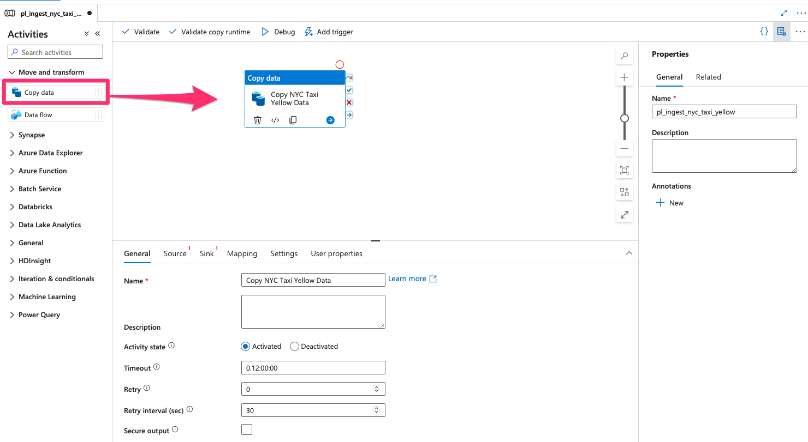
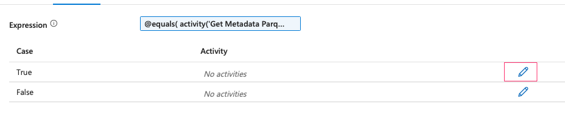

#### 1.1 Create datasets
- First we need to create new Datasets. Navigate to Author --> click 3-dot option next to Datasets:

- Select Blob Storage

- File type is parquet:

- Linked service should be the one connected to the blob storage account. Click on the folder icon to select the path

- Repeat the same steps, but this time select Azure data lake and the linked service connecting to it.

- We need another dataset for lookup, the file type this time is Delimeted Text:

#### 1.2 Create Ingestion pipeline

- The first pipeline we are going to generate is to copy the parquet file from blob storage to the data lake under the condition that the file must exist in blob storage. After being copied, all the files should be removed from containers.
    - So first we need to check if files exist
    - Get the metadata of the directory to get all the files details
    - Filter parquet file only then get the file name
    - Get metadata of parquet file such as column count, structure...
    - If column count = 19, then authorize copy activity, otherwise send notification to Discord
    - Delete all files after copied

- Click on the 3-dot option next to Pipellines to create a new pipeline:

- Under Move and transform, drag Copy data to the pipeline Dashboard:

- Select the source and destination (sink) of the data ingestion:

- Test the pipeline by clicking on Debug:

- Validate if files exists: Under General, drag Validation to the pipeline board:

- The validation is going to check for a day, sleep every 600 seconds (10 minutes) and min file size is 1024MB.

- Next step we'll get the metadata of the dataset so that we can filter the parquet file and get the metadata out of it. Drag "Get Metadata" to the pipeline board, then connect "If files exist to it".

- Click on Debug, you'll see the metadata of the dataset:

- Now we need to filter parquet file:

- Get the name of the first parquet file: drag Set variable to the pipeline dashboard then configure as below:

- Now we can get the Metadata from the parquet file: drag Get metadata into the pipeline, connect it with Set Varible. In the Settings, we need to create a new dataset.

- The container type is Blob storage and file type is parquet.

- Create a new parameter in the new dataset:

- In Connection Setting, set the file name by the new parameter:

- Get back to the Get Metadata in pipeline, fileName should be set as the variable get from the previous step. Also add some new arguments in the Field list:

- Click debug to test the pipeline, you'll see that the metadata has been successfully extracted:

- Next step is to check if the dataset has 18 columns. If True, we'll allow to copy data into ADL storage. Otherwise, We'll send a notification. Firstly, drag If condition into the pipeline and connect it with the previous step

- Write the condition for column count:

- In the True Activities, copy "Copy NYC Taxi Yellow Data" step to it.

- In the False Activities, drag in Fail and Webhook. Set a simple fail message and error code. In Webhook, paste into your Discord URL.

- Delete the "Copy NYC Taxi Yellow Data" in the pipeline, we don't need it anymore.

- After copying the source file into data lake container, we need to delete all the files in the blob container. Go back to the True Statement in If Condition and drag Delete into it. We need to create a new dataset which point to the whole container.

- Click on Debug to test the pipeline:

#### 1.3 Connect ingestion pipeline to Databricks notebook

- Instead of manually running the Import Schema notebook in Databricks then the ingestion pipeline can start working, we can connect the notebook job at the beginning. Therefore, whenever we upload the data file to the container, it will trigger to notebook job then the whole ingestion.

- First we need to create an access token in Databricks. See how to create [here](https://docs.databricks.com/en/dev-tools/auth/pat.html)

- Drag Databricks Notebook into the pipeline, we need to create a new linked service:

- Select the notebook path:

- Review the updated pipeline:

#### 1.4 Create trigger for Ingestion pipeline:

- Next we need to set up a trigger for ingestion pipeline which is whenever we upload the data file into container, it should process the pipeline.

- Let's try delete all the files in blob container and upload a new one. You can see that your pipeline will start running.

#### 1.5 Create ingestion pipeline for lookup file:

Repeat the same steps to copy lookup file from blob container. However, since the lookup file is csv type, you won't need to import schema using databricks. Simple Copy activity in Data Factory can automatically import the schema.

