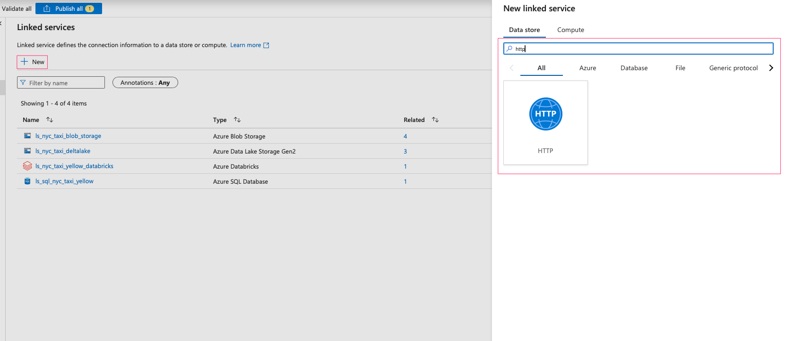
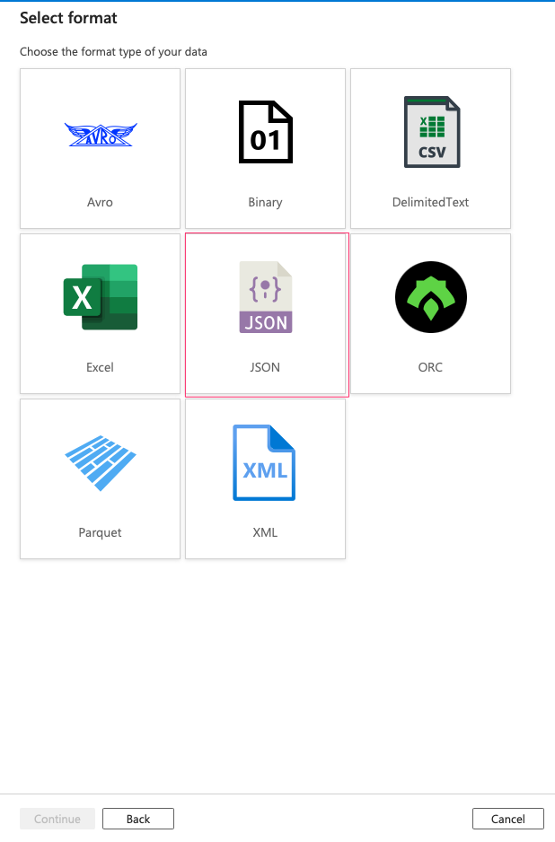
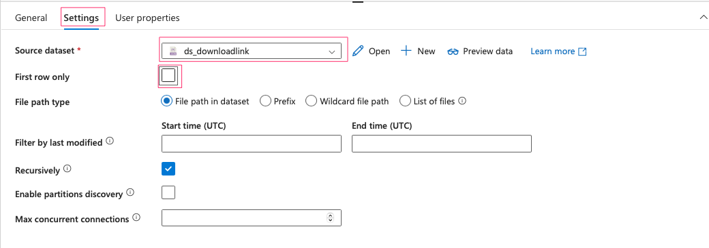
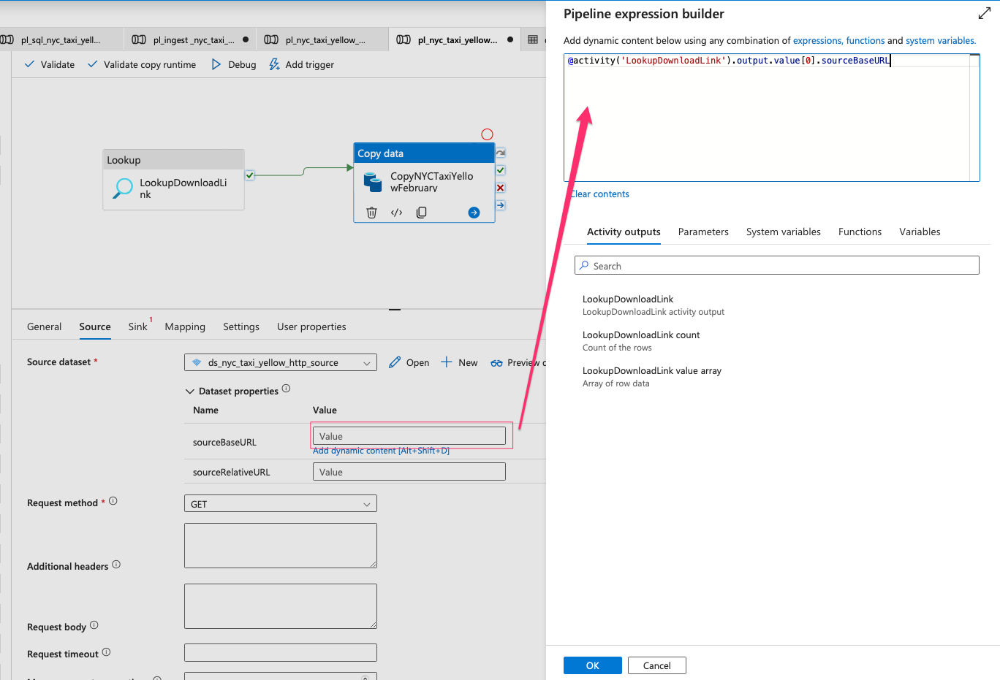

####  Get Download Link:

Execute the scrapejob.py file located in the data_scraping folder. Ensure that all required dependencies are installed by running the requirements.txt file, and you may need to change connection string, container name to connect to your blob container. The program will retrieve the download link from the source website and upload it to the blob container as a JSON file.

A new JSON file will be generated, containing information such as the base URL, relative URL, file name the directory of sink path.

The JSON is automatically uploaded to blob container:

####  Create Linked Service:

Next, we need to create a linked service to the http address we just get.

Create a new parameter for the linked service. This parameter will later take baseURL from the download link as a variable.

In the Base URL, select the new parameter you have just created:

####  Create Datasets:

We need to create 2 new datasets for the source, sink and a dataset for the download link. The source is from blob container while the sink is from ADLS2. 
First, create a new dataset for source

Create 2 new parameters for the source dataset:

Assign those 2 parameters to the values of Source Base URL and Relative URL:

Next, create sink dataset

Create a new parameter as sinkDirectory for source dataset:

Assign the new parameter to the file path:

Create a new dataset for downloadlink:

####  Ingestion Pipeline:

For data ingestion via http, we will use lookup activity to read the json file to get download link, then will use the link to directly ingest parquet file into ADLS2.

Drag Lookup activity into the pipeline:

In the Settings tab, select the dataset as downloadlink. Please remember to tick off option "First row only"

Drag Copy Activity into the pipeline:

Source settings:

Sink settings:

You can test the pipeline using Debug:

The rest of the pipeline will be the same as ingestion from blob container.