#### 3.1 Create a new Dataflow:

- Click on the 3-dot option then New data flow:

- Add a new source which is the NYC taxi yellow data:

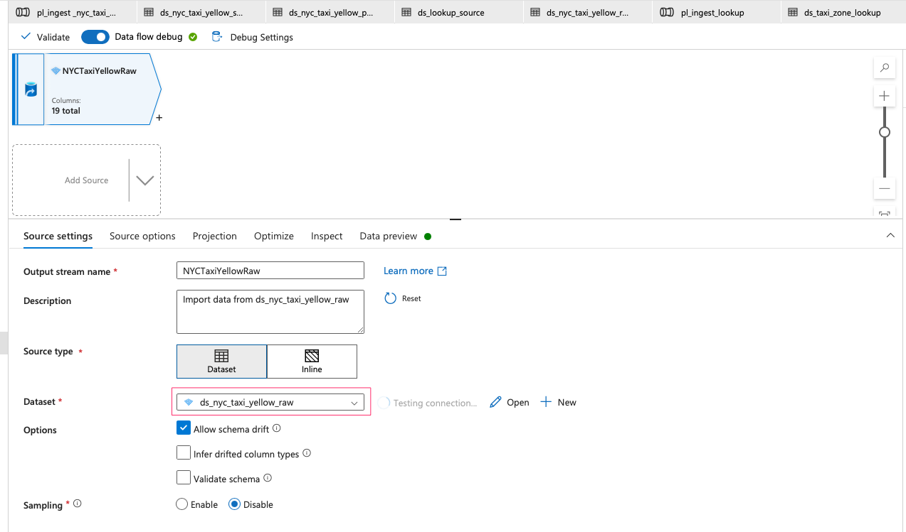

- Add another source which is the lookup file:

- You may need to change the data type of LocationID as Integer:

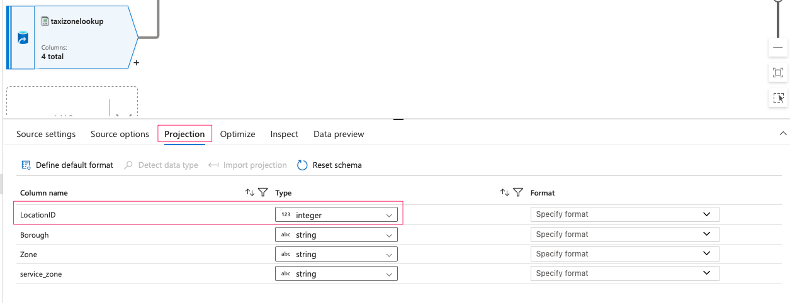

- We need to create new columns for Pickup and Dropoff in the lookup file. Add Derived Column, then create those new columns as below:

- Select necessary columns: 

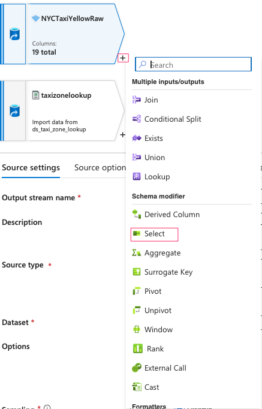

- Keep these below columns and delete the rest:

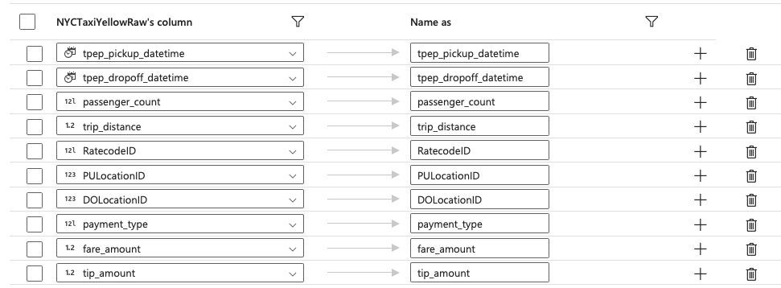

- Add Lookup in the next transformation step. PULocationID and DOLocationID in Taxi data should match with PULocationID and DOLocationID in the lookup file.

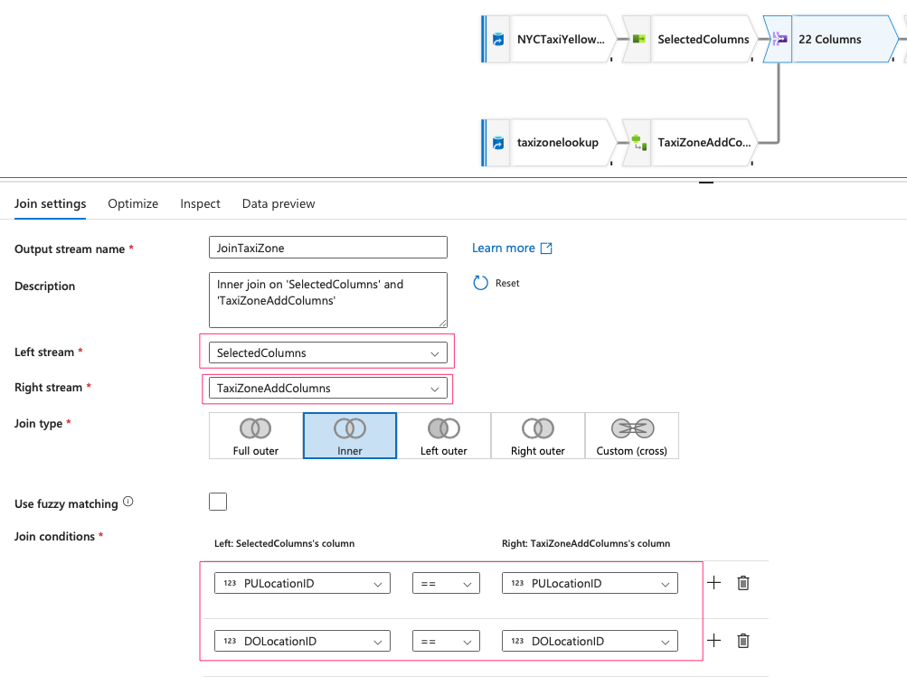

- Turn all Fare amount values into absolute values: add Derived Column into the flow:

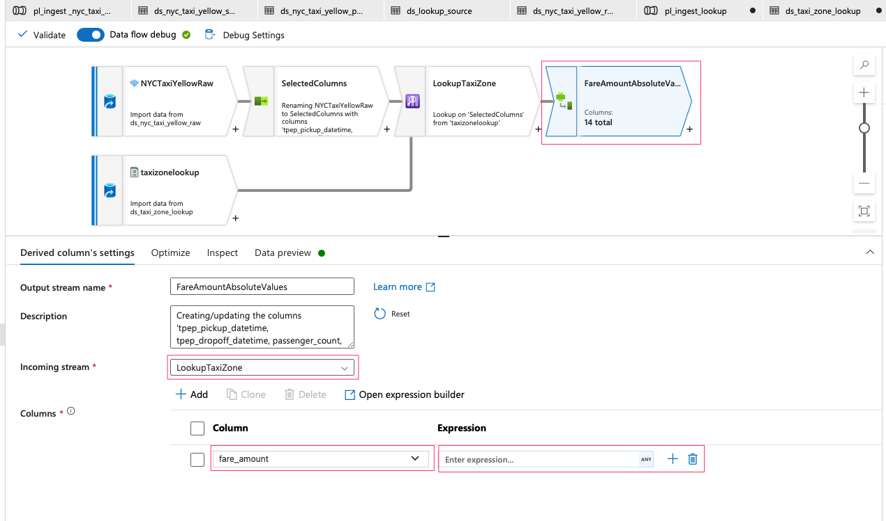

- Filter for trip distance and fare amount to be greater than 0 only: add Filter into the flow:

- In this step we are going to calculate the average of tip amount and fill in missing values. First, add Window into the flow. Then create a new column called tip_amount_avg:

- Add Derived Column into the flow, then fill in missing values for tip_amount:

- Next step is to find the median of passenger_count to fill in missing value. Azure Data Factory does not support a median function, therefore we have to walk around a bit. First, we have to input the source again, then sort passenger_count to find the median value. After that, we will join the median with the original flow.

- Add the NYC taxi yellow source:

- Select only passenger_count column using Select:

- Sort passenger_count using Sort:

- Next we need to turn the passenger_count into a list and find the numer of rows using Aggregate:

- Now we already sorted the passenger count and had the row count. We need to find the median value using Derived Column:

- We also need to create another column called group and assign a constant value so that later we can join with the original data:

- We need to do the same for the original flow. So add a Dervied Column to the original flow, then create a column call group with constant value 1:

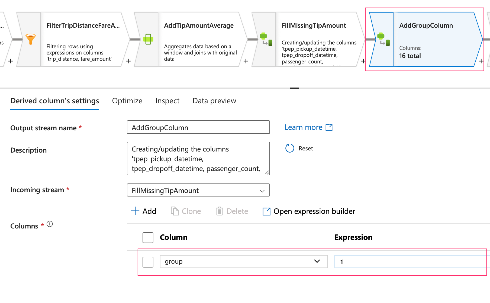

- Now we need to Join the 2 flows together:

- With the new median column, we can fill in missing values for passenger_count using Derived Column:

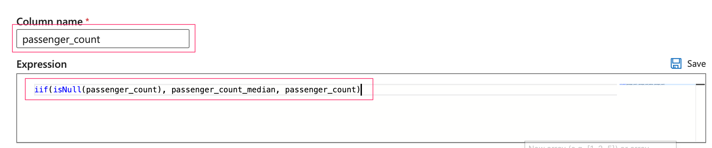

- Drop unnecessary columns using Select:

- Update RatecodeID: add Derived Column to the flow:

- Drop 'Unknow' PUBorough and DOBorough using Filter:

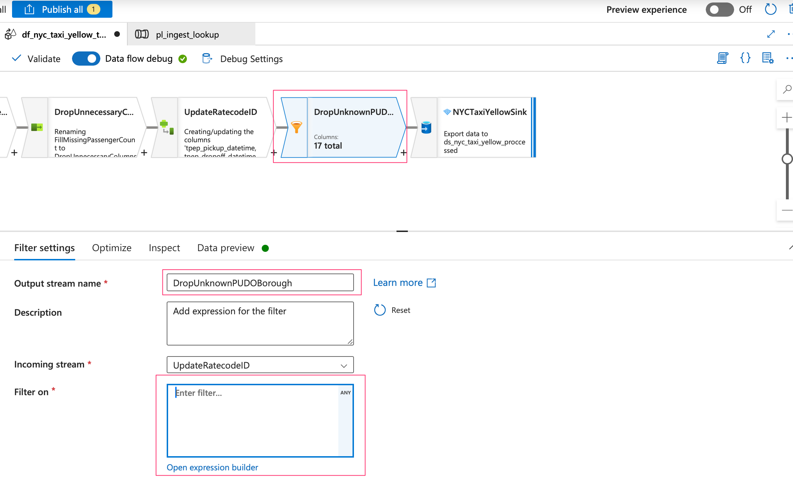

- Update RatecodeID 99 to null: add Derived Column to the flow

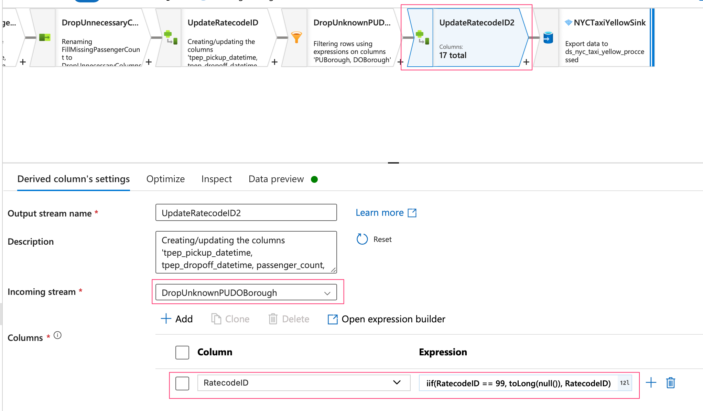

- Update RatecodeID to specific Borough and zone conditions when RatecodeID is null: add Derived Column to the flow:

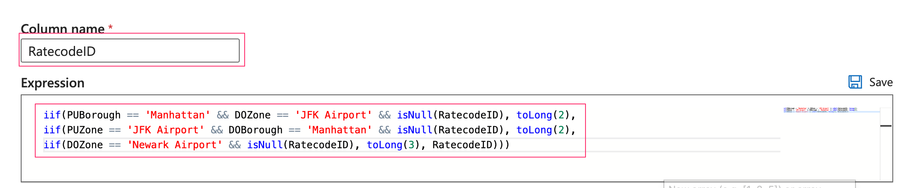

- Set the rest of null RatecodeID to 1:

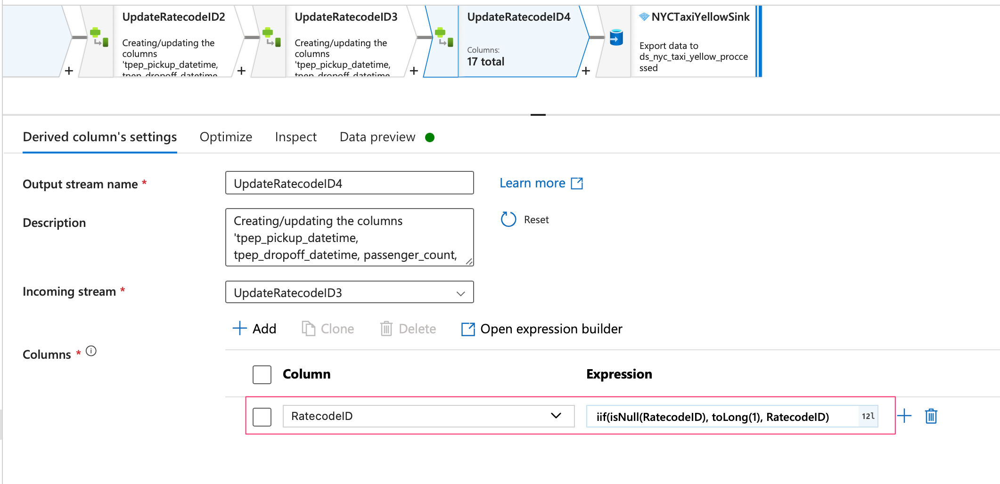

- Update the values of RatecodeID to make them more meaningful:

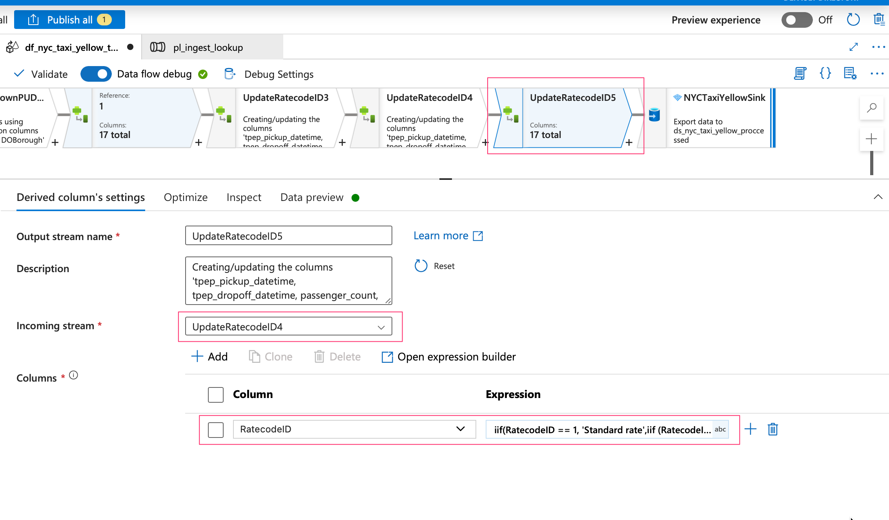
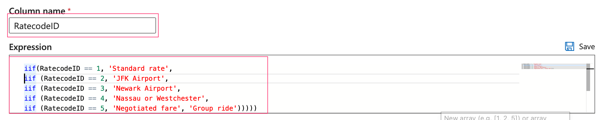

- We have reach the final step of data transformation. Add Sink into the flow:

- Create a new dataset for Sink:

#### 3.2 Add a new pipeline for the dataflow generate:

- Create a new pipeline then drag Data Flow into the pipeline:

- In the Settings tab, select data flow and compute size:

