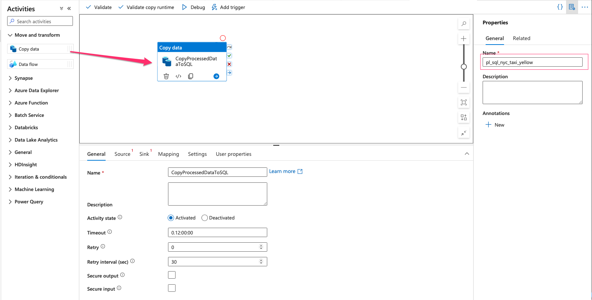
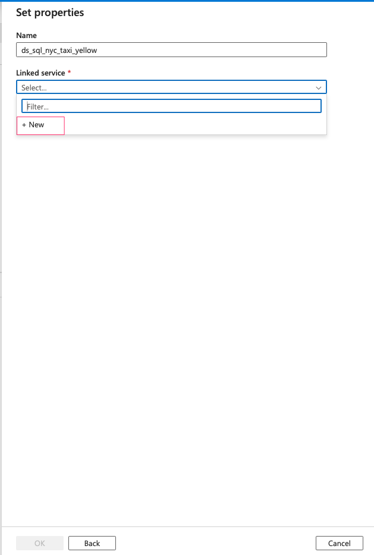
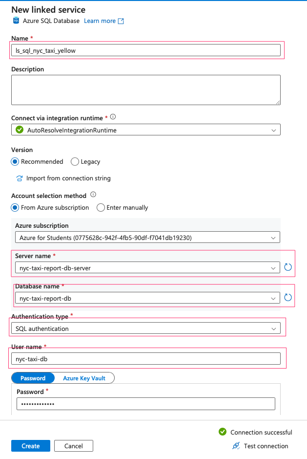

####  Create NYC Taxi Yellow SQL Table

- Access to your SQL database you have created before. Open Query Editor (you also can use Azure Data Studio to create tables):

- Upload SQL file into the query editor or you can write your own:

- Run the Query to generate table:

####  Create A Pipeline to Ingest processed data to SQL database:

- Create a new pipeline and drag Copy data into the pipeline

- Source is the processed dataset:

- We need to create a new dataset for sink:

- Dataset type is SQL:

- We also need to create a new linked service:

- You can run a simple query to test your table:

