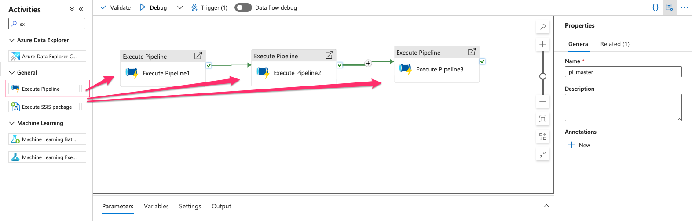
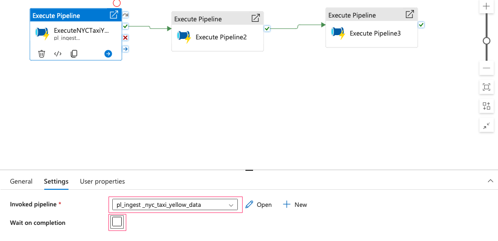
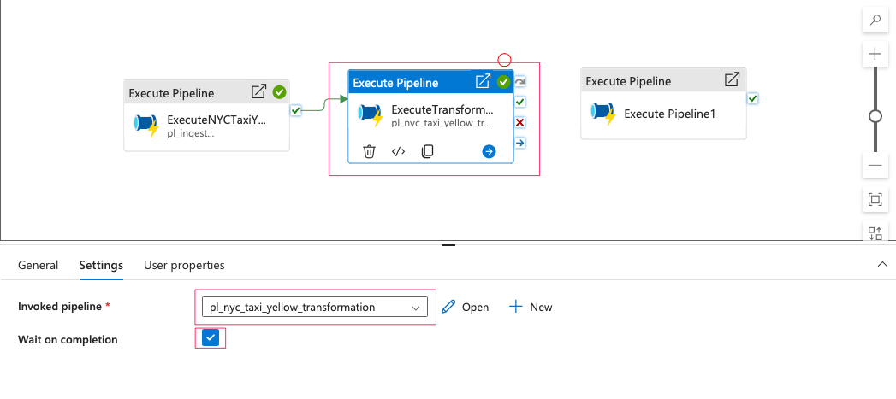
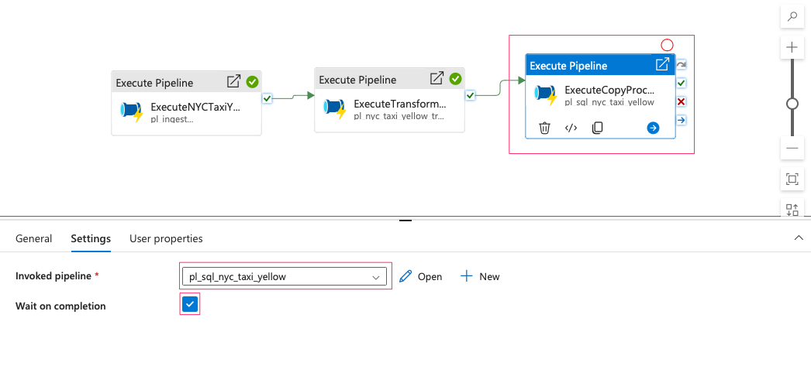
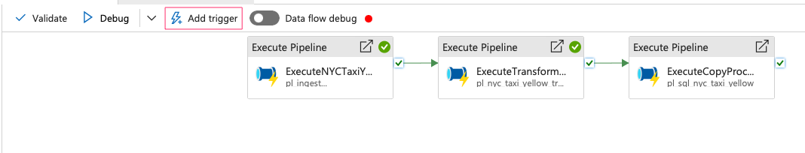

- Create a new pipeline and drag 3 Execute pipelines into the board:

- First is to excute NYC Taxi Yellow Ingestion Data. Since this is the first pipeline, we don't need it to be waited on completion of the previous pipeline:

- Second execution is transformation and it needs to wait until the ingestion pipeline to be finished.

- Third execution is copy processed data into SQL database:

##### Create A Trigger for Master Pipeline:

- The will start when we upload the parquet file into blob container. So firstly, we need to removed all the triggers we created before, then create a new one.

